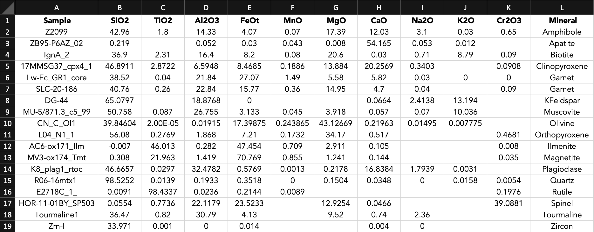

=================
Importing Package
=================

We import the package mineralML in Python. 

.. code-block:: python

   import mineralML as mm
   
==============
Importing Data
==============

We walk through an implementation of ``mineralML`` here. Create this following file structure locally: 

::

    mineralML/
    ├── Chemistry.csv
    ├── BNN_Run.csv
    └── AE_Run.py

The following columns are required for this Chemistry file:

*  Sample
*  SiO\ :sub:`2`
*  TiO\ :sub:`2`
*  Al\ :sub:`2`O\ :sub:`3`
*  FeO\ :sub:`t`
*  MnO
*  MgO 
*  CaO 
*  Na\ :sub:`2`O
*  K\ :sub:`2`O
*  Cr\ :sub:`2`O\ :sub:`3`

For example, here a screenshot of a CSV spreadsheet containing the mineral composition data. You can use the ChemistryTemplate.csv from the GitHub repository to create your own. For oxides that were not analyzed or not detected, enter 0 into the cell. 

For the mineral composition, ``mineralML`` asks that users provide Fe as FeO\ :sub:`t`. To avoid ambiguity, the Chemistry file handles this by providing only one column for FeO\ :sub:`t`.

We use the os package in Python to facilitate navigation to various files. To load the Chemistry file, you must provide the path to the CSV. 

.. code-block:: python

    path = os.getcwd() + '/Chemistry.csv'
    df_load = mm.load_df(path)
    df, _ = mm.prep_df(df_load)

mm.load_df returns df_load, an initial dataframe of all of all samples and their chemistry. mm.prep_df then prepares the loaded dataframe, filling in any nan values, and selecting only the minerals covered within the Bayesian neural network or the autoencoder.

====================
Data Import Complete 
====================

That is all for loading your mineral chemical compositions! You are ready to get rolling with ``mineralML``. See the example notebook BNN_Colab.ipynb, under the big examples heading, to see how to run ``mineralML`` and export files. 
